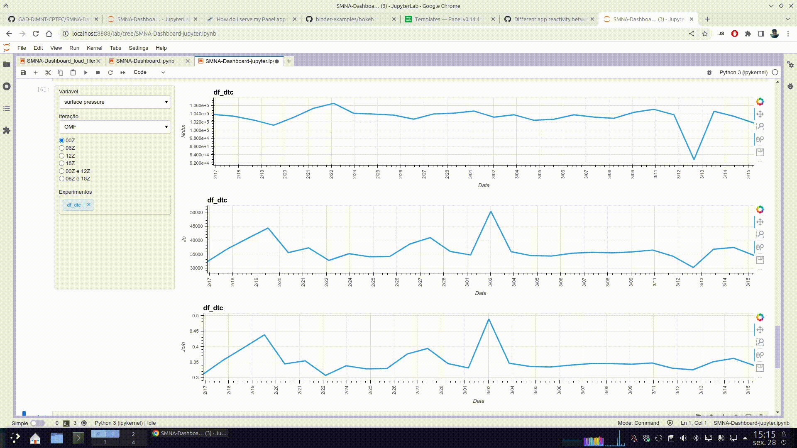

# SMNA-Dashboard

<a target="_blank" href="https://colab.research.google.com/github/GAD-DIMNT-CPTEC/SMNA-Dashboard/blob/main/SMNA-Dashboard-jupyter.ipynb">
  
</a>

Este repositório trata da organização e apresentação dos resultados do GSI em relação à minimização da função custo (Jo - termo referente às observações) do 3DVar. São fornecidos três notebooks:

1. `SMNA-Dashboard_load_files_create_dataframe_save.ipynb`: utilizado para a leitura e organização dos arquivos de log do GSI;
2. `SMNA-Dashboard.ipynb`: utilizado para fornecer a interface de dashboard para a exploração dos resultados;
3. `SMNA-Dashboard-jupyter.ipynb`: utilizado para fornecer as widgets sem a interface do dashboard (os dados são explorados dentro do próprio Jupyter).

Nas animações a seguir, são mostradas as widgets dentro da interface do Jupyter e por meio do Panel (acessível em https://gad-dimnt-cptec.github.io/SMNA-Dashboard/SMNA-Dashboard.html).




## Uso

Para a utilização local dos notebooks, recomenda-se a utilização do arquivo de ambiente `environment.yml` para a criação do ambiente `SMNA` com os pacotes necessários para a utilização do dashboard. Para criar o ambiente, utilize o comando a seguir:

```
conda env create -f environment.yml
```

Os notebooks fornecidos são utilizados na ordem apresentada acima. Se o repositório for baixado para teste, então pode-se utilizar apenas o notebook `SMNA-Dashboard.ipynb`, da seguinte forma:

```
panel serve SMNA-Dashboard.ipynb --autoreload --show
```

O comando acima, abre diretamente a interface do dashboard no navegador. Para abrir o conteúdo do notebook (incluindo o notebook `SMNA-Dashboard_load_files_create_dataframe_save.ipynb`), execute o comando:

```
jupyter-notebook SMNA-Dashboard-jupyter.ipynb
```

**Nota:** o notebook `SMNA-Dashboard_load_files_create_dataframe_save.ipynb` contém exemplos de indexação do dataframe `dts`.

## Informações

Especificamente, são tratadas as seguintes informações, obtidas a partir do arquivo de log do GSI:

```
Begin Jo table outer loop
    Observation Type           Nobs                        Jo        Jo/n
surface pressure             101588    3.6963295810242533E+04       0.364
temperature                   54009    8.4362268122117763E+04       1.562
wind                         174592    2.2575676441332555E+05       1.293
moisture                      21242    9.4984707783307513E+03       0.447
gps                          280594    5.4391758277321467E+05       1.938
radiance                     171806    1.8338082096514766E+05       1.067
                               Nobs                        Jo        Jo/n
           Jo Global         803831    1.0838792028623789E+06       1.348
End Jo table outer loop
```

A depender da quantidade de outer e inner loops, o GSI registra um número diferente de informações sobre o número de observações consideradas (`Nobs`), o custo da minimização do termo observacional (`Jo`) e o custo da minimização do termo observacional normalizado pelo número de observações (`Jo/n`). A configuração do GSI/3DVar aplicado ao SMNA (válido para a data de escrita deste notebook), considera `miter=2` e `niter=3`, ou seja, 2 outer loops com 3 inner loops cada. Para os experimentos considerados, cada inner loop (`niter`) é realizado com 0, 50 e 100 iterações, respectivamente. Nesse sentido, as informações obtidas a partir das iterações do processo de minimização da função custo do termo observacional, consideram o seguinte:

* OMF: início do primeiro outer loop, onde o estado do sistema é dado pelo background;
* OMF (1st INNER LOOP): final do primeiro inner loop do primeiro outer loop, onde o estado do sistema ainda é dado pelo background;
* OMF (2nd INNER LOOP): final do segundo inner loop do primeiro outer loop, onde o estado do sistema ainda é dado pelo background;
* OMA (AFTER 1st OUTER LOOP): início do segundo outer loop, onde o estado do sistema é dado pela análise;
* OMA (1st INNER LOOP): final do primeiro inner loop do segundo outer loop, onde o estado do sistema é dado pela análise;
* OMA (2nd INNER LOOP): final do segundo inner loop do segundo outer loop, onde o estado do sistema é dado pela análise;
* OMA (AFTER 2nd OUTER LOOP): final do segundo outer loop, análise final.

**Nota:** as informações das iterações `OMF` e `OMF (1st INNER LOOP)` são iguais, assim como as informações das iterações `OMA (AFTER 1st OUTER LOOP)` e `OMA (1st INNER LOOP)`.

As informações do log do GSI são organizadas em um dataframe com a marcação das datas e a inclusão das informações sobre os outer e inner loops:

```
     Date                Observation Type Nobs   Jo            Jo/n  Iter
   0 2023-02-16 06:00:00 surface pressure 104308 32537.652151  0.312 OMF
   1 2023-02-16 06:00:00 temperature      25065  9857.265337   0.393 OMF
   2 2023-02-16 06:00:00 wind             127888 61267.072233  0.479 OMF
   3 2023-02-16 06:00:00 moisture         8705   2103.832442   0.242 OMF
   4 2023-02-16 06:00:00 gps              291665 600962.196931 2.060 OMF
 ...                 ...              ...    ...           ...   ... ...
5399 2023-03-16 00:00:00 wind             203048 129312.187759 0.637 OMA (AFTER 2nd OUTER LOOP)
5400 2023-03-16 00:00:00 moisture         22219  4948.997007   0.223 OMA (AFTER 2nd OUTER LOOP)
5401 2023-03-16 00:00:00 gps              264466 392890.280946 1.486 OMA (AFTER 2nd OUTER LOOP)
5402 2023-03-16 00:00:00 radiance         183884 56169.185410  0.305 OMA (AFTER 2nd OUTER LOOP)
5403 2023-03-16 00:00:00 Jo Global        832986 645663.456547 0.775 OMA (AFTER 2nd OUTER LOOP)
```

Considerando vários experimentos, os dataframes são concatenados em um só (`dfs`), o qual é salvo em disco no formato CSV. A indexação do dataframe `dfs` pode ser feita da seguinte forma:

1. Escolha de um subdataframe (e.g., `df_dtc`): 

    `df_dtc1 = dfs.xs('df_dtc', axis=1)`

2. Escolha de uma variável (e.g., `surface pressure`): 

    `df_dtc1.loc[df_dtc1['Observation Type'] == 'surface pressure'].reset_index(drop=True)`
    
3. Escolha de um parâmetro (e.g., `Iter`): 

    `df_dtc1.loc[df_dtc1['Observation Type'] == 'surface pressure'].loc[df_dtc1['Iter'] == 'OMF'].reset_index(drop=True)`
    
4. Escolha de um horário (e.g., `00:00:00`, o mesmo que 00Z): 

    `df_dtc1.loc[df_dtc1['Observation Type'] == 'surface pressure'].loc[df_dtc1['Iter'] == 'OMF'].set_index('Date').at_time(str('00:00:00')).reset_index(drop=False)`

5. Escolha de um intervalo de datas (e.g., `2023-02-17` a `2023-03-19`):

    `df_dtc1.set_index(['Date']).loc['2023-02-17':'2023-02-19']`

**Nota:** nesta versão, a consideração dos valores de `miter` e `niter` não está generalizada. Para outras configurações, será necessário ajustar os valores de `i` na função `df_Nobs`.

---

Carlos Frederico Bastarz (carlos.bastarz@inpe.br), Abril de 2023.
